# Windows Sysmon Splunk Process Monitoring Lab

## Project Overview

This lab demonstrates how to collect and investigate Windows process execution telemetry using Sysmon and Splunk Enterprise.

A Windows 11 host was configured with the Splunk Universal Forwarder to send both native Windows Security Event Logs and Sysmon Operational logs to a Splunk Enterprise server running on an Ubuntu virtual machine.

After validating log ingestion, process creation events were generated and investigated using Splunk Search Processing Language (SPL), allowing reconstruction of parent-child process relationships commonly analyzed during Security Operations Center (SOC) investigations.

---

## Objectives

- Configure centralized Windows log collection.
- Install and validate Sysmon telemetry.
- Forward Sysmon events into Splunk Enterprise.
- Generate process creation activity.
- Investigate parent-child process relationships.
- Build baseline process execution visibility using SPL queries.

---

## Lab Environment

| Component | Technology |
|----------|------------|
| Host System | Windows 11 |
| SIEM | Splunk Enterprise |
| Log Forwarder | Splunk Universal Forwarder |
| Endpoint Telemetry | Sysmon |
| Virtualization | Oracle VirtualBox |
| Log Server | Ubuntu Linux |
| Network Mode | Bridged Adapter |

---

## Project Workflow

Windows Security Logs / Sysmon

↓

Splunk Universal Forwarder

↓

Splunk Enterprise (Ubuntu)

↓

Search & Investigation

---

## Step 1: Verify Windows Security Event Collection

Confirmed that Windows Security Event Logs were successfully being forwarded into Splunk.

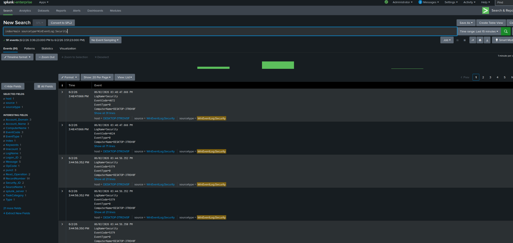

---

## Step 2: Verify Sysmon Installation Status

Checked the local system to confirm Sysmon was not already installed before deployment.

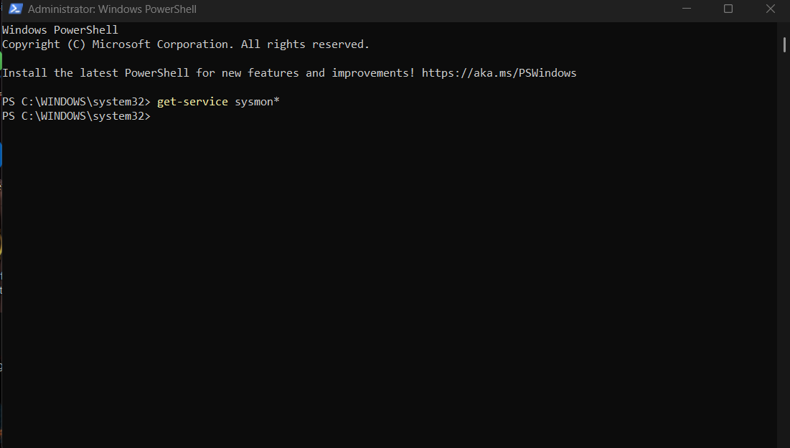

---

## Step 3: Install Sysmon

Sysmon was installed using Sysinternals and configured to begin collecting detailed endpoint telemetry.

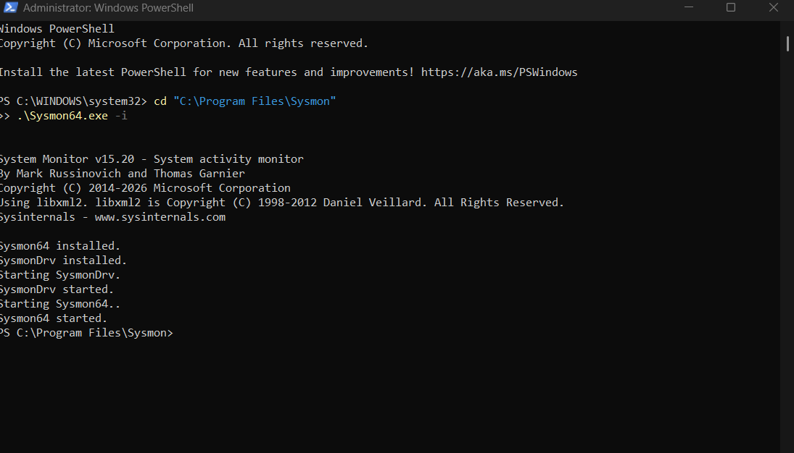

---

## Step 4: Validate Local Sysmon Logging

Verified that Sysmon Operational events were being generated successfully within Windows Event Viewer.

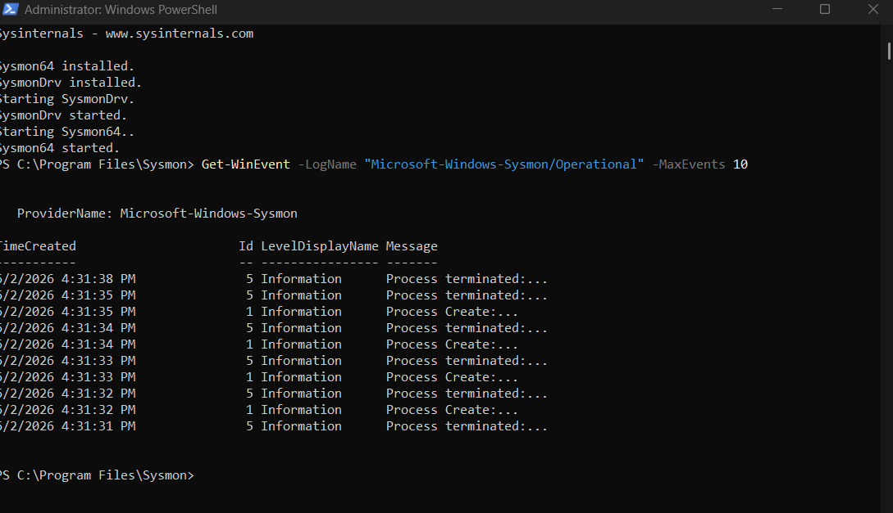

---

## Step 5: Configure Splunk Universal Forwarder

Updated the Universal Forwarder inputs.conf file to begin forwarding Sysmon Operational logs.

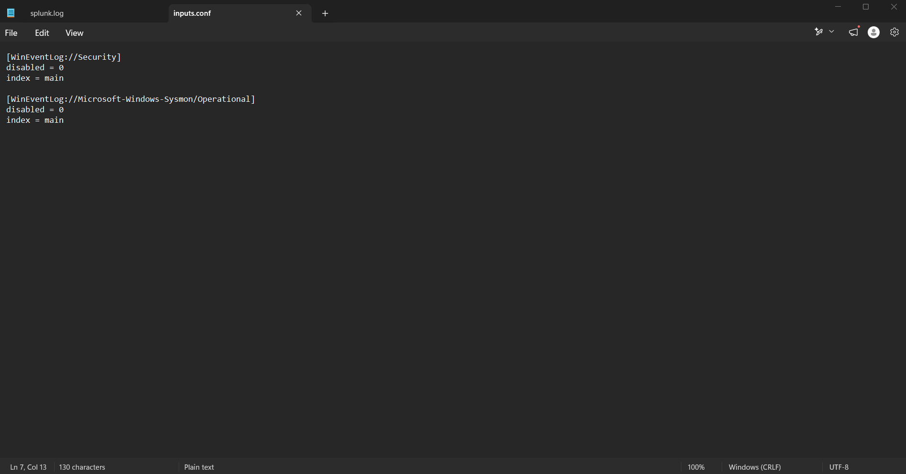

After updating the configuration, the Splunk Universal Forwarder service was restarted.

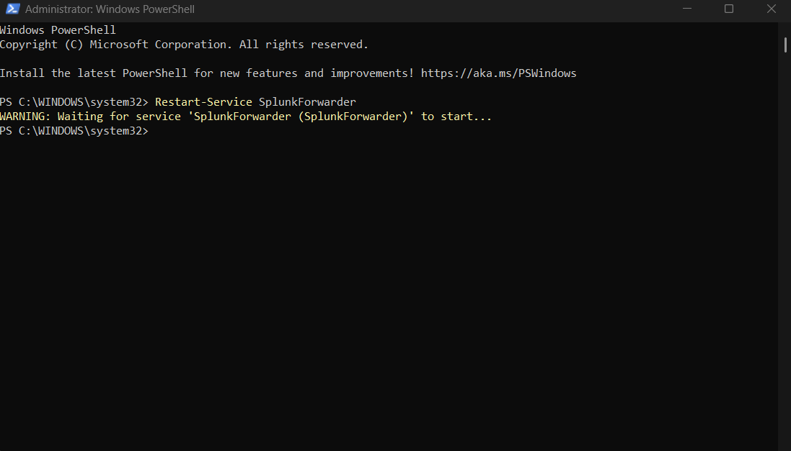

The service status was then verified.

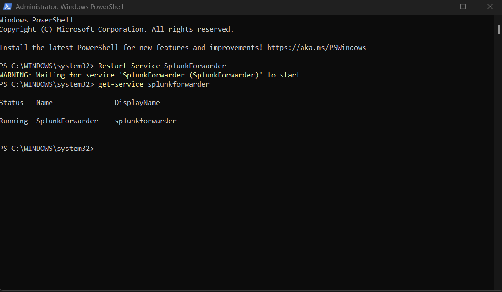

---

## Step 6: Verify Sysmon Events in Splunk

Confirmed that Sysmon Operational logs were successfully arriving in Splunk Enterprise.

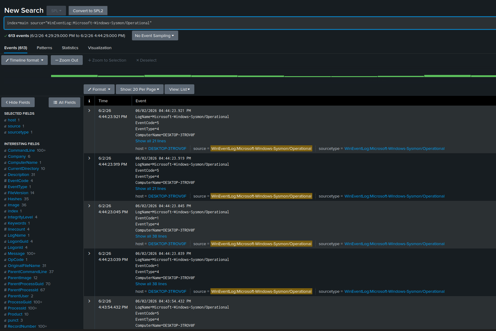

---

## Step 7: Generate Process Creation Activity

A Notepad process was created from the Windows Command Prompt to simulate basic endpoint activity.

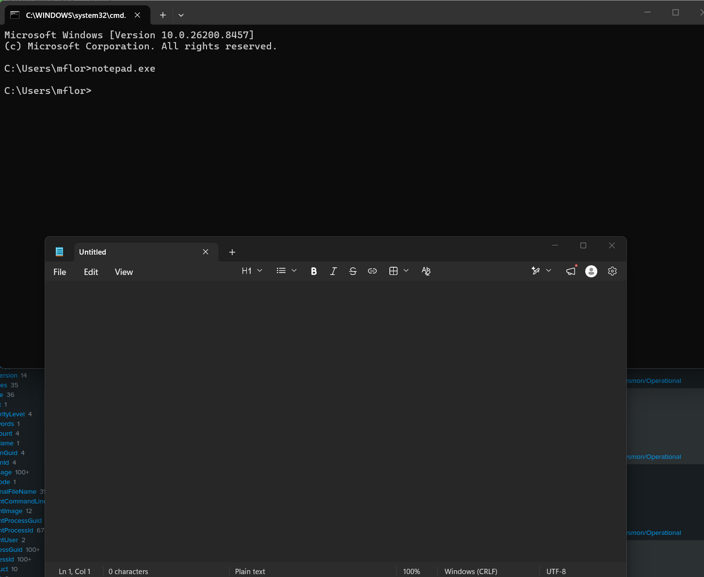

Sysmon allowed reconstruction of the parent-child process relationship.

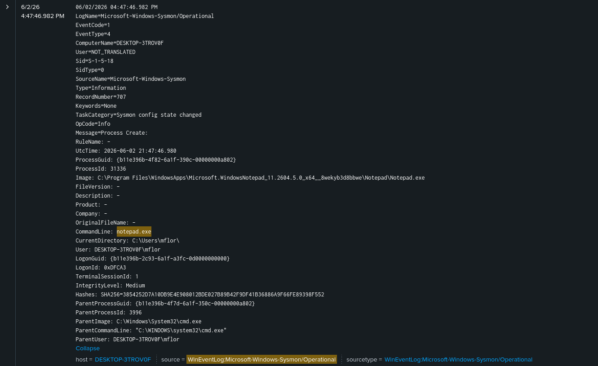

A PowerShell process was then launched from Command Prompt.

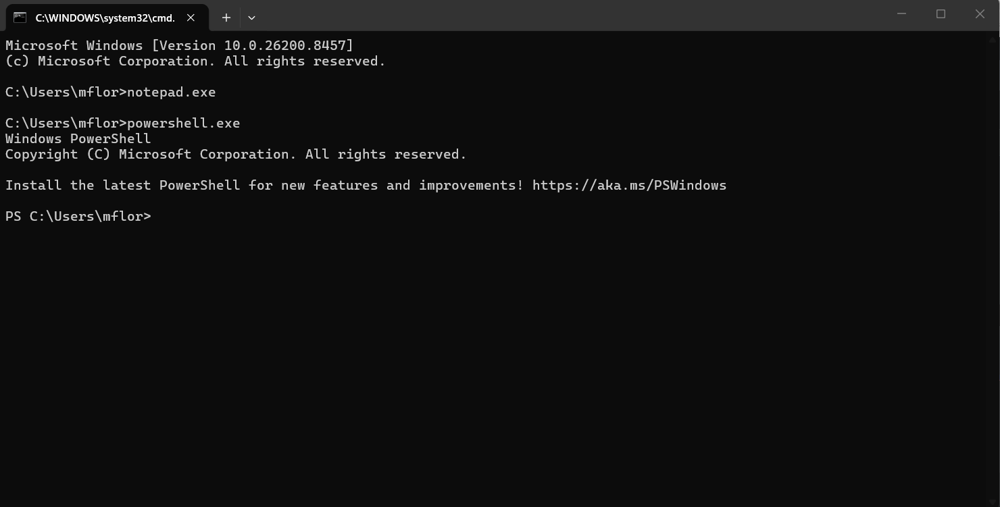

The resulting Sysmon event provided detailed process execution metadata.

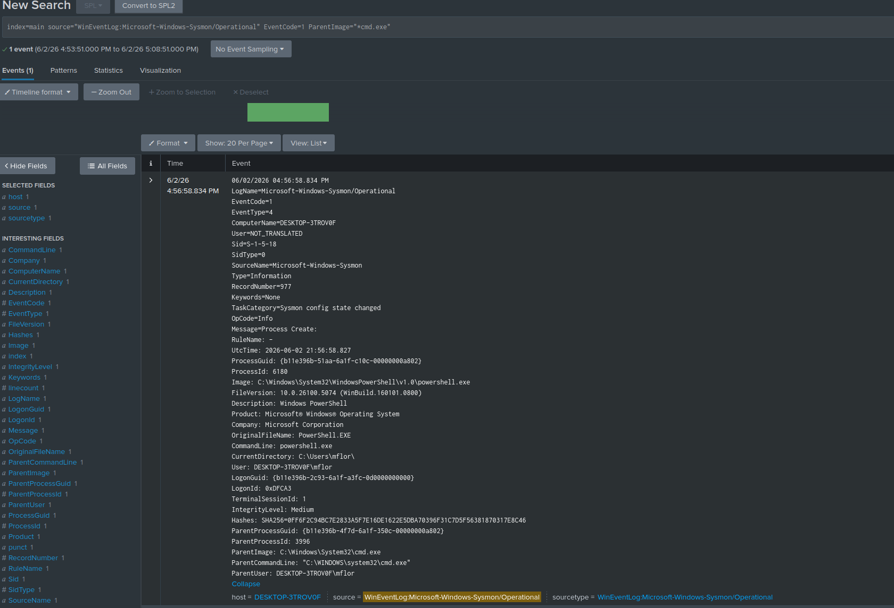

---

## Step 8: Baseline Process Execution

A Splunk SPL query was used to establish a baseline of process execution frequency.

```spl
index=main source="WinEventLog:Microsoft-Windows-Sysmon/Operational" EventCode=1
| stats count by Image
| sort - count
```

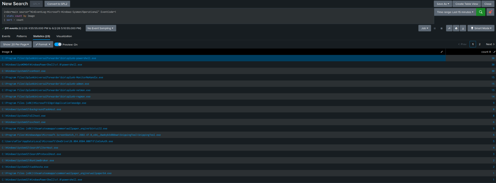

---

## Step 9: Hunt for Processes Spawned by Command Prompt

A targeted SPL query was used to identify child processes launched from cmd.exe.

```spl
index=main source="WinEventLog:Microsoft-Windows-Sysmon/Operational" EventCode=1 ParentImage="*cmd.exe"
| table _time User ParentImage Image CommandLine
```

This type of parent-child analysis is commonly used by SOC analysts during threat investigations.

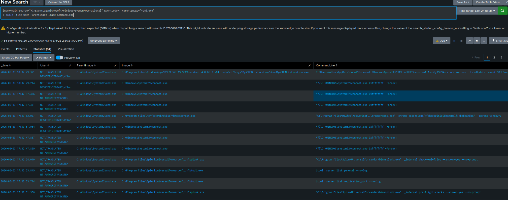

---

## Skills Demonstrated

- Splunk Enterprise Administration
- Splunk Universal Forwarder Configuration
- Windows Event Logging
- Sysmon Deployment
- Log Ingestion Validation
- SPL Query Development
- Process Creation Analysis
- Parent-Child Process Investigation
- Windows Endpoint Monitoring
- Security Operations Center (SOC) Investigation Workflow

---

## Key Takeaways

This lab demonstrates the complete pipeline required for Windows endpoint monitoring:

**Windows Endpoint → Sysmon → Splunk Universal Forwarder → Splunk Enterprise → Threat Investigation**

By combining Sysmon telemetry with Splunk search capabilities, process execution activity can be reconstructed and analyzed in a manner similar to real-world SOC investigations.
